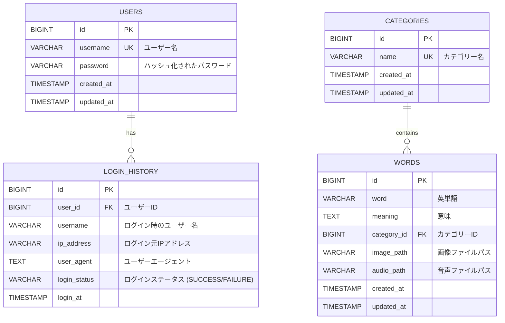

## 詳細設計書 (Detailed Design Document)

### 1. データベース設計 (Database Design)

#### 1.1. エンティティ関連図 (Entity Relationship Diagram - ERD)



#### 1.2. テーブル定義 (Table Definitions)

##### 1.2.1. `users` テーブル

| カラム名 | データ型 | 制約 | 説明 |
| :------- | :------- | :--- | :--- |
| `id` | `BIGINT` | `PK`, `AUTO_INCREMENT` | ユーザーID |
| `username` | `VARCHAR(255)` | `NOT NULL`, `UNIQUE` | ユーザー名 |
| `password` | `VARCHAR(255)` | `NOT NULL` | ハッシュ化されたパスワード |
| `created_at` | `TIMESTAMP` | `NOT NULL`, `DEFAULT CURRENT_TIMESTAMP` | 作成日時 |
| `updated_at` | `TIMESTAMP` | `NOT NULL`, `DEFAULT CURRENT_TIMESTAMP ON UPDATE CURRENT_TIMESTAMP` | 更新日時 |

##### 1.2.2. `login_history` テーブル

| カラム名 | データ型 | 制約 | 説明 |
| :------- | :------- | :--- | :--- |
| `id` | `BIGINT` | `PK`, `AUTO_INCREMENT` | ログイン履歴ID |
| `user_id` | `BIGINT` | `FK` (`users.id`), `NULLABLE` | ログインしたユーザーのID (ユーザーが削除された場合はNULL) |
| `username` | `VARCHAR(255)` | `NOT NULL` | ログイン時のユーザー名 |
| `ip_address` | `VARCHAR(45)` | `NULLABLE` | ログイン元IPアドレス |
| `user_agent` | `TEXT` | `NULLABLE` | ユーザーエージェント文字列 |
| `login_status` | `VARCHAR(20)` | `NOT NULL` | ログインステータス (`SUCCESS`, `FAILURE`) |
| `login_at` | `TIMESTAMP` | `NOT NULL`, `DEFAULT CURRENT_TIMESTAMP` | ログイン日時 |

##### 1.2.3. `categories` テーブル

| カラム名 | データ型 | 制約 | 説明 |
| :------- | :------- | :--- | :--- |
| `id` | `BIGINT` | `PK`, `AUTO_INCREMENT` | カテゴリーID |
| `name` | `VARCHAR(255)` | `NOT NULL`, `UNIQUE` | カテゴリー名 |
| `created_at` | `TIMESTAMP` | `NOT NULL`, `DEFAULT CURRENT_TIMESTAMP` | 作成日時 |
| `updated_at` | `TIMESTAMP` | `NOT NULL`, `DEFAULT CURRENT_TIMESTAMP ON UPDATE CURRENT_TIMESTAMP` | 更新日時 |

##### 1.2.4. `words` テーブル

| カラム名 | データ型 | 制約 | 説明 |
| :------- | :------- | :--- | :--- |
| `id` | `BIGINT` | `PK`, `AUTO_INCREMENT` | 単語ID |
| `word` | `VARCHAR(255)` | `NOT NULL` | 英単語 |
| `meaning` | `TEXT` | `NOT NULL` | 意味 |
| `category_id` | `BIGINT` | `FK` (`categories.id`), `NULLABLE` | 関連するカテゴリーID (カテゴリーが削除された場合はNULL) |
| `image_path` | `VARCHAR(255)` | `NULLABLE` | 画像ファイルのパス (例: `images/uuid.jpg`) |
| `audio_path` | `VARCHAR(255)` | `NULLABLE` | 音声ファイルのパス (例: `audios/uuid.mp3`) |
| `created_at` | `TIMESTAMP` | `NOT NULL`, `DEFAULT CURRENT_TIMESTAMP` | 作成日時 |
| `updated_at` | `TIMESTAMP` | `NOT NULL`, `DEFAULT CURRENT_TIMESTAMP ON UPDATE CURRENT_TIMESTAMP` | 更新日時 |

### 2. API設計 (API Design)

バックエンドはRESTful APIを提供します。主要なAPIエンドポイントを定義します。

#### 2.1. 認証・ユーザー関連API

| エンドポイント | HTTPメソッド | 説明 | リクエストボディ | レスポンスボディ | 備考 |
| :------------- | :----------- | :--- | :--------------- | :--------------- | :--- |
| `/api/auth/register` | `POST` | ユーザー登録 | `UserRegistrationRequest` | `UserDto` | |
| `/api/auth/login` | `POST` | ユーザーログイン | `AuthenticationRequest` | `AuthenticationResponse` (JWT含む) | |
| `/api/users/me` | `GET` | ログインユーザー情報取得 | なし | `UserDto` | 認証必須 |
| `/api/users/me` | `PUT` | ログインユーザー情報更新 | `UserUpdateRequest` | `UserDto` | 認証必須 |

#### 2.2. カテゴリー関連API

| エンドポイント | HTTPメソッド | 説明 | リクエストボディ | レスポンスボディ | 備考 |
| :------------- | :----------- | :--- | :--------------- | :--------------- | :--- |
| `/api/categories` | `GET` | カテゴリー一覧取得 | なし | `List<CategoryDto>` | |
| `/api/categories` | `POST` | カテゴリー登録 | `CategoryCreateRequest` | `CategoryDto` | 認証必須 |
| `/api/categories/{id}` | `GET` | 特定カテゴリー取得 | なし | `CategoryDto` | |
| `/api/categories/{id}` | `PUT` | カテゴリー更新 | `CategoryDto` | `CategoryDto` | 認証必須 |
| `/api/categories/{id}` | `DELETE` | カテゴリー削除 | なし | なし (204 No Content) | 認証必須 |

#### 2.3. 単語関連API

| エンドポイント | HTTPメソッド | 説明 | リクエストボディ | レスポンスボディ | 備考 |
| :------------- | :----------- | :--- | :--------------- | :--------------- | :--- |
| `/api/words` | `GET` | 単語一覧取得 | クエリパラメータ: `categoryId`, `page`, `size` | `PagedResult<WordWithCategoryDto>` | |
| `/api/words` | `POST` | 単語登録 | `WordDto` (multipart/form-dataでファイル含む) | `WordDto` | 認証必須 |
| `/api/words/{id}` | `GET` | 特定単語取得 | なし | `WordDto` | |
| `/api/words/{id}` | `PUT` | 単語更新 | `WordDto` (multipart/form-dataでファイル含む) | `WordDto` | 認証必須 |
| `/api/words/{id}` | `DELETE` | 単語削除 | なし | なし (204 No Content) | 認証必須 |

#### 2.4. ファイル関連API

| エンドポイント | HTTPメソッド | 説明 | リクエストボディ | レスポンスボディ | 備考 |
| :------------- | :----------- | :--- | :--------------- | :--------------- | :--- |
| `/files/{type}/{filename}` | `GET` | ファイル取得 | なし | ファイルデータ | `type`は`images`または`audios` |

#### 2.5. ログイン履歴関連API

| エンドポイント | HTTPメソッド | 説明 | リクエストボディ | レスポンスボディ | 備考 |
| :------------- | :----------- | :--- | :--------------- | :--------------- | :--- |
| `/api/login-history` | `GET` | ログイン履歴取得 | クエリパラメータ: `page`, `size` | `PagedResult<LoginHistoryDto>` | 認証必須 |

### 3. コンポーネント設計 (Component Design)

#### 3.1. バックエンド (Spring Boot)

##### 3.1.1. パッケージ構成

```
com.example.englishapp
├── config            // セキュリティ設定、Web設定など
├── controller        // REST APIエンドポイント
├── dto               // データ転送オブジェクト (Request/Response)
├── exception         // カスタム例外クラス、グローバル例外ハンドリング
├── mapper            // MyBatis Mapperインターフェース、XMLマッピング
├── service           // ビジネスロジック
├── util              // JWTユーティリティなど
└── EnglishAppApplication.java // メインアプリケーションクラス
```

##### 3.1.2. 主要コンポーネント

*   **Controller**:
    *   `UserController`: ユーザー登録、ログイン、ユーザー情報取得・更新
    *   `CategoryController`: カテゴリーのCRUD操作
    *   `WordController`: 単語のCRUD操作、ファイルアップロード
    *   `LoginHistoryController`: ログイン履歴取得
*   **Service**:
    *   `UserService`: ユーザー関連のビジネスロジック（登録、認証、情報更新）
    *   `CategoryService`: カテゴリー関連のビジネスロジック
    *   `WordService`: 単語関連のビジネスロジック、ファイル保存
    *   `CustomUserDetailsService`: Spring Securityのユーザー詳細サービス
    *   `LoginHistoryService`: ログイン履歴の記録と取得
    *   `AuthenticationEventListener`: ログイン成功/失敗イベントのリスナー
*   **Mapper**:
    *   `UserMapper`: `users`テーブルとのマッピング
    *   `CategoryMapper`: `categories`テーブルとのマッピング
    *   `WordMapper`: `words`テーブルとのマッピング
    *   `LoginHistoryMapper`: `login_history`テーブルとのマッピング
*   **Config**:
    *   `SecurityConfig`: Spring Securityの設定（認証、認可、JWTフィルタ）
    *   `JwtRequestFilter`: JWTトークンの検証と認証情報のセット
    *   `WebConfig`: CORS設定など
*   **Util**:
    *   `JwtUtil`: JWTトークンの生成、検証、情報抽出

##### 3.1.3. ファイルアップロード処理

1.  `WordController`がファイルを含むリクエストを受け取る。
2.  `WordService`がファイルを受け取り、指定されたディレクトリ（例: `uploads/images`, `uploads/audios`）に保存する。
3.  保存されたファイルのパスをデータベースの`words`テーブルに記録する。
4.  ファイルはNginxを通じて静的に配信される。

#### 3.2. フロントエンド (React/TypeScript)

##### 3.2.1. ディレクトリ構成

```
frontend/src
├── api             // バックエンドAPIとの連携ロジック
├── assets          // 静的アセット
├── components      // 再利用可能なUIコンポーネント
│   └── layouts     // レイアウトコンポーネント
├── context         // グローバルステート管理 (例: AuthContext)
├── pages           // 各ページのコンポーネント
├── types           // TypeScriptの型定義
├── App.tsx         // ルートコンポーネント
├── main.tsx        // エントリーポイント
└── ...
```

##### 3.2.2. 主要コンポーネント

*   **Pages**:
    *   `LoginPage`: ログインフォーム
    *   `RegisterPage`: ユーザー登録フォーム
    *   `HomePage`: カテゴリー一覧、単語一覧へのリンク
    *   `CategoryPage`: カテゴリーのCRUD操作画面
    *   `WordPage`: 単語のCRUD操作画面、カテゴリー別フィルタリング
    *   `WordDetailPage`: 単語の詳細表示（画像、音声再生）
    *   `LoginHistoryPage`: ログイン履歴表示
    *   `AccountPage`: ユーザー情報更新
*   **Components**:
    *   `SideMenu`: ナビゲーションメニュー
    *   `CategoryList`: カテゴリー一覧表示
    *   `WordList`: 単語一覧表示
    *   `CategoryForm`: カテゴリー登録・編集フォーム
    *   `WordForm`: 単語登録・編集フォーム（ファイルアップロード含む）
    *   `ProtectedRoute`: 認証済みユーザーのみアクセス可能なルートを保護
    *   `MainLayout`: 共通レイアウト
*   **Context**:
    *   `AuthContext`: 認証状態（ログインユーザー情報、JWTトークン）を管理し、アプリケーション全体で共有

##### 3.2.3. API連携

*   `apiClient.ts`: AxiosなどのHTTPクライアント設定、認証トークンの付与
*   `userApi.ts`, `categoryApi.ts`, `wordApi.ts`, `fileApi.ts`: 各リソースに対応するAPI呼び出し関数

### 4. テスト計画 (Test Plan)

#### 4.1. テストフェーズ

*   **単体テスト (Unit Test)**:
    *   対象: 各クラス、関数、コンポーネント
    *   ツール: JUnit (Java), React Testing Library / Jest (React)
    *   目的: 個々のコンポーネントが正しく動作することを確認
*   **結合テスト (Integration Test)**:
    *   対象: 複数のコンポーネント間の連携、APIエンドポイント
    *   ツール: Spring Boot Test (Java), Cypress / Playwright (E2E)
    *   目的: コンポーネント間のインターフェースが正しく機能することを確認
*   **システムテスト (System Test)**:
    *   対象: システム全体
    *   目的: 要件定義通りにシステムが動作することを確認
*   **受け入れテスト (Acceptance Test)**:
    *   対象: ユーザー視点での機能確認
    *   目的: ユーザーが期待する動作を満たしていることを確認

#### 4.2. テストカバレッジ

*   バックエンド: Jacocoを用いてコードカバレッジを測定し、主要なビジネスロジックは80%以上のカバレッジを目指す。
*   フロントエンド: 主要なコンポーネントに対してスナップショットテストやイベントシミュレーションテストを実施。

### 5. デプロイ・運用設計 (Deployment and Operation Design)

#### 5.1. デプロイメント

*   **環境**: DockerとDocker Composeを使用し、開発環境と本番環境で一貫したデプロイメントを実現する。
*   **手順**:
    1.  `docker-compose.yml` を使用してコンテナをビルドし、起動する。
    2.  フロントエンドのビルド成果物をNginxコンテナに配置する。
    3.  データベースの初期スキーマとデータは`mysql/init/01-schema.sql`で自動的に適用される。

#### 5.2. 運用

*   **ログ監視**: Docker Composeのログ機能 (`docker-compose logs -f <service_name>`) を利用して、各コンテナのログをリアルタイムで監視する。
*   **ヘルスチェック**: 各コンテナのヘルスチェックエンドポイント（もしあれば）を利用して、コンテナの稼働状況を監視する。
*   **バックアップ**: MySQLデータベースの定期的なバックアップ戦略を確立する。
*   **スケーリング**: 必要に応じて、Docker SwarmやKubernetesなどのコンテナオーケストレーションツールを導入し、スケーリングに対応する。